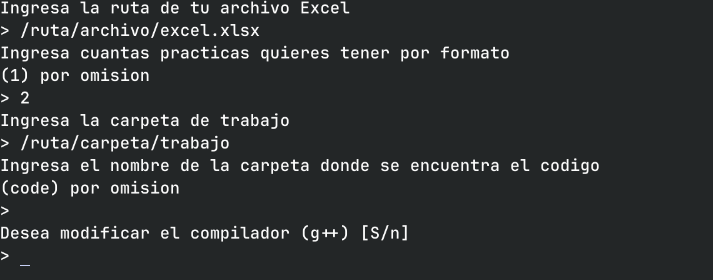

# Creador de manuales

Un creador de manual simple

## Dependencias

- [JRE](https://www.java.com/es/download/manual.jsp)
- `leafpad` si esta en Linux
- Capturadores como [silicon](https://github.com/Aloxaf/silicon) y/o [germanium](https://github.com/matsuyoshi30/germanium)
  (aunque estos ya se encuentran dentro de los paquetes)

En el caso de que se este ejecutando en Windows, se necesita configurar un compilador de C++, puede ser cualquiera
solo asegúrese de que el compilador se encuentre dentro del PATH de ejecución, en el mismo que se ejecuta `manualCreator`

## Descarga

Después de haber leído las [dependencias](#dependencias) puedes descargar el paquete
en este [link](https://github.com/Kedap/creadorManual/releases/latest), selecciona de
acuerdo a tu sistema operativo



## Construir

Para construir se necesitan las dependencias ya especificadas en
[dependencias](#dependencias), pero también el proyecto hace uso del **JDK** 17
por lo que es necesario instalarlo, también [**maven** ](https://maven.apache.org/guides/getting-started/maven-in-five-minutes.html)
y **python** para ejecutar el script de empaquetador

- JDK 17
- Maven
- Python

### Construir y empaquetar

```sh
mvn clean
mvn install
python releaseAssets/empaquetador.py
```

y los paquetes se encuentran en `target/paquetes`
